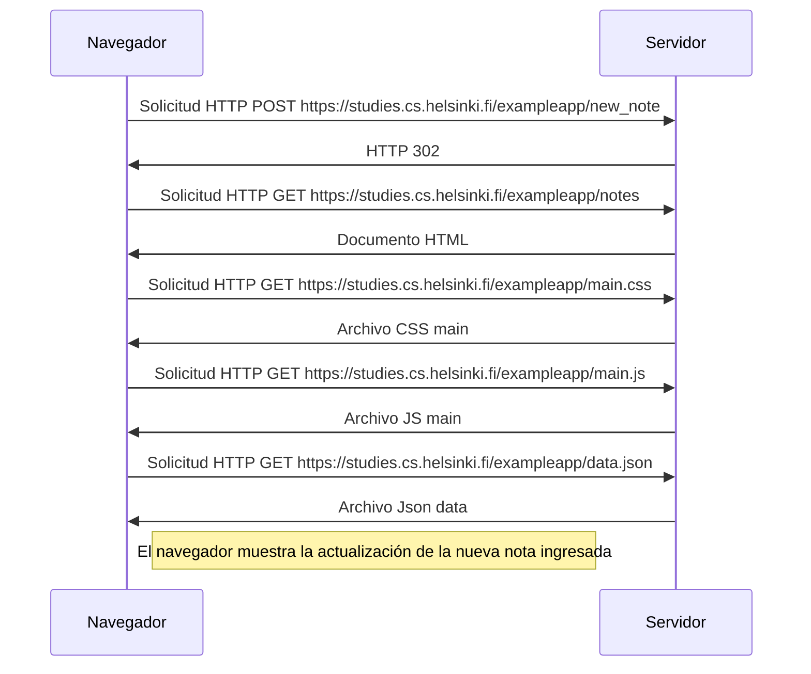

# Diagrama de secuencia que describa la interacción con el usuario al crear una nueva nota
https://studies.cs.helsinki.fi/exampleapp/notes

```mermaid
sequenceDiagram

participant N as Navegador
participant S as Servidor

N ->> S: Solicitud HTTP POST https://studies.cs.helsinki.fi/exampleapp/new_note
S ->> N: HTTP 302

N ->> S: Solicitud HTTP GET https://studies.cs.helsinki.fi/exampleapp/notes
S ->> N: Documento HTML

N ->> S: Solicitud HTTP GET https://studies.cs.helsinki.fi/exampleapp/main.css
S ->> N: Archivo CSS main

N ->> S: Solicitud HTTP GET https://studies.cs.helsinki.fi/exampleapp/main.js
S ->> N: Archivo JS main

N ->> S: Solicitud HTTP GET https://studies.cs.helsinki.fi/exampleapp/data.json
S ->> N: Archivo Json data

Note right of N: El navegador muestra la actualización de la nueva nota ingresada
```
